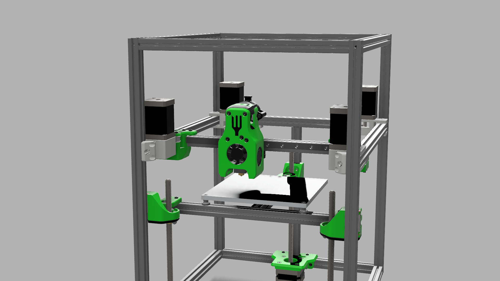

# Quad AB Drives for the SaladFork
Note that the XY Joints are basically mirrored compared to the orignal ones. They require the same build parts.The Idlers from the original tensioners are needed for the modificated drive mounts in the back.

# NOTE
Klipper currently (23.04.2022, master) does not support multiple AB Drives for CoreXY. Follow the [VZBot-Vz235 Manual](https://github.com/VzBoT3D/VzBoT-Vz235) to set up the machine. 

## BOM
only additionaly needed parts are listed

2x NEMA14
2x Pulleys
screws & nuts

## Credits
[TypQxQ](https://github.com/TypQxQ/klipper/tree/Multiple_Steppers_on_CoreXY) for the Klipper adaptations 
